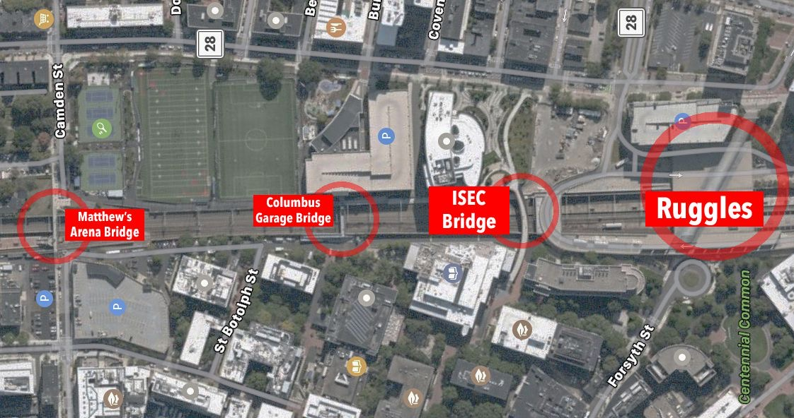

# Four Bridges Speedrun

This speedrun requires crossing all four bridges (in any order) that cross the orange line as fast as possible. These bridges are:
- Ruggles
- ISEC Bridge (Rusty Bridge)
- Columbus Garage Bridge
- Matthew's Arena Bridge

The time starts once you start crossing your first bridge, and ends after crossing the last of the four bridges. You must start from the bottom of the stairs on the starting bridge, and end at the bottom of the stairs of you ending bridge. There are only 2 realistic bridges that a runner would start from (Matthew's or Ruggles), and at each of those, there are 2 possible starting sides. This gives this run 4 potential starting positions. The 100% category is for normal runs, and the TAS 100% category is if the runner would like to use a bike/longboard/other external tool to assist with the run.

No Verified Runs for this speedrun yet... Submit a run [here](https://forms.gle/hHda5Qc1Fa8ozx5f7)

## Categories:

### 100% Leaderboard

| Position |    Runner     |  Time | Date|Link|
|:----------:|:-------------:|:------:|:----:|:---:|
| **1st** | Empty | 0m 00s 000ms  | September 20th, 2020 | [Link]() |
| **2nd** | Empty | 0m 00s 000ms  | September 20th, 2020 | [Link]() |
| **3rd** | Empty | 0m 00s 000ms  | September 20th, 2020 | [Link]() |

### TAS 100% Leaderboard

| Position |    Runner     |  Time | Date|Link|
|:----------:|:-------------:|:------:|:----:|:---:|
| **1st** | Empty | 0m 00s 000ms  | September 20th, 2020 | [Link]() |
| **2nd** | Empty | 0m 00s 000ms  | September 20th, 2020 | [Link]() |
| **3rd** | Empty | 0m 00s 000ms  | September 20th, 2020 | [Link]() |

[Other Categories](../../README.md)
