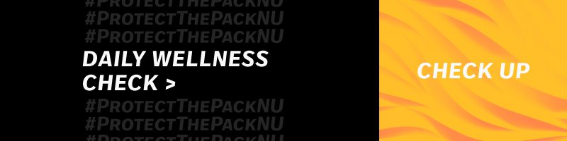
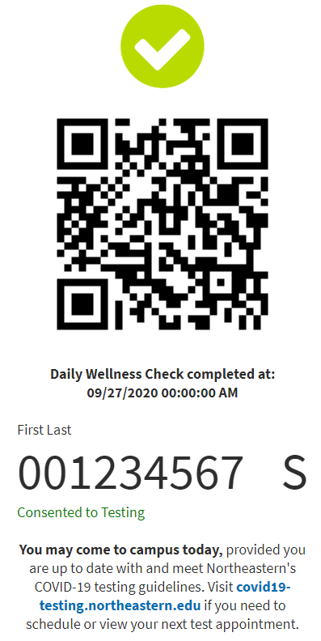
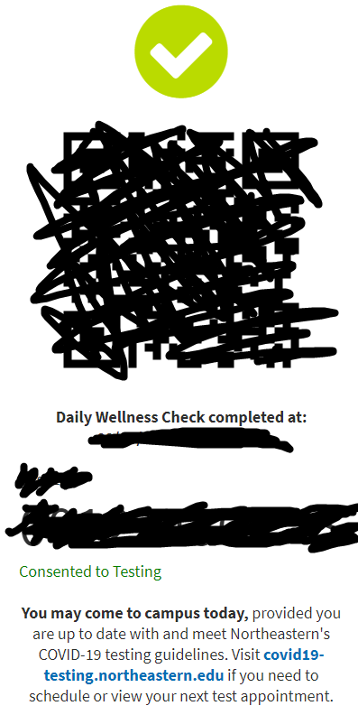

# Daily Wellness Check (DWC) Speedrun

### This speedrun has **a few specific rules** that **must be followed**:
- You cannot let this speedrun jeopardize the integrity of the Daily Wellness Check system:
  - You **MUST**:
    - Fill out the Daily Wellness Check with the correct responses that apply to you (i.e. If you have symptoms, you must properly state that on the Wellness Check. If you do NOT have symptoms, you must properly state that on the Wellness Check).
    - Fill out the Wellness check before going on to campus in general, so therefore, you cannot be on campus during the day before completing this speedrun (as you would not have done your DWC).
    - Pre-check the Daily Wellness Check to make sure the options have not changed and to make sure you know what options you are going to click.
- You can only fill it out/submit one run per day (As with the tradtional Daily Wellness Check)
- Be sure to blur/obscure any personal information 
that appears on your screen.
- Ideally, runs should be recorded with an external camera (screen capture allowed if paired with external video) to prevent editing tricks.

**Disclaimer**: If any of these rules are broken, your run will not be counted and you may not be allowed to submit future runs. (We don't want this speedrun thing to get shutdown). Also, we are not responsible for anyone incorrectly submitting their Daily Wellness Check. 

---

---

This speedrun is simple. The time starts as soon as you click "Daily Wellness Check" on the Student Hub, and the time ends on the first frame that the QR Code screen appears (**Note:** You MUST blur/obscure the QR Code itself, your student ID, any othe personal information on the page). On top of that, both questions must be answered correctly according to your symptoms (as mentioned above).

| Wrong |    Right     | 
|:----------:|:-------------:|
||

At this current time, loading time *is* included in the time for the run. This may be removed in the future, but for now, you must take into account the ridiculously long amount of time the page can take to load both when opening and submitting.

No Verified Runs for this speedrun yet... Submit a run [here](https://forms.gle/hHda5Qc1Fa8ozx5f7)

## Categories:

### 100% Leaderboard

| Position |    Runner     |  Time | Date| Link |
|:----------:|:-------------:|:------:|:----:|:---:|
| **1st** | Empty | 0m 00s 000ms  | September 20th, 2020 | [Link]() |
| **2nd** | Empty | 0m 00s 000ms  | September 20th, 2020 | [Link]() |
| **3rd** | Empty | 0m 00s 000ms  | September 20th, 2020 | [Link]() |

[Other Categories](../../README.md)

